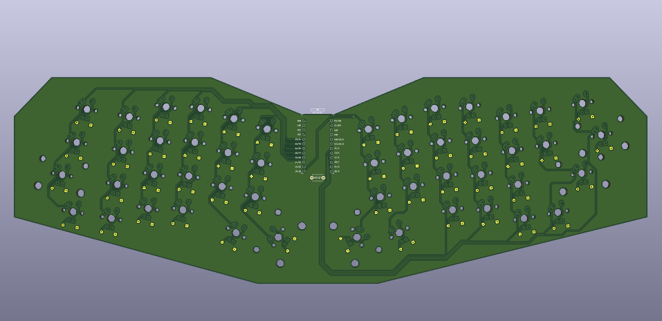
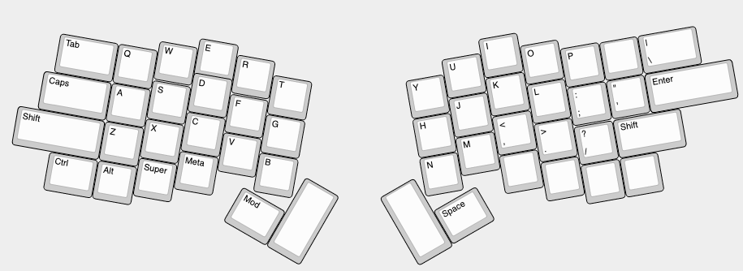

# Elixir

The Elixir is a monoblock ergonomic mechanical keyboard with support for most keycap kits. The design has been greatly inspired by the [Atreus](https://github.com/technomancy/atreus), [Sweep](https://github.com/davidphilipbarr/Sweep) and [Sofle](https://github.com/josefadamcik/SofleKeyboard) keyboards.

## Motivation

The Elixir was born out of a desire to create an 'introductory' ergonomic mechanical keyboard. Its simple and inexpensive construction enables those who want to 'give it a shot' to do so without much time or monetary investment. Furthermore, it supports regular modifiers on the outer most-columns, reducing friction to those who already have their own keycap sets.

## QMK Firmware

- [QMK](https://docs.qmk.fm/#/) Quantum Mechanical Keyboard firmware

## Gallery

## License

The Elixir Keyboard is licensed under [Creative Commons Attribution-NonCommercial 4.0 International License](https://creativecommons.org/licenses/by-nc/4.0).
