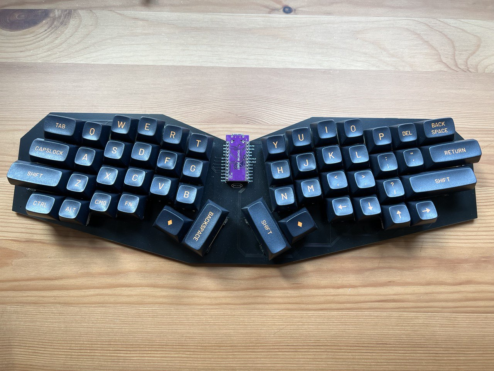

# Elixir

The Elixir is a monoblock ergonomic mechanical keyboard. The design has been greatly inspired by the [Atreus](https://github.com/technomancy/atreus), [Sweep](https://github.com/davidphilipbarr/Sweep) and [Sofle](https://github.com/josefadamcik/SofleKeyboard) keyboards.

## Motivation

The Elixir was born out of a desire to create an 'introductory' ergonomic mechanical keyboard. Its simple and inexpensive construction reduces the time and cost required to get started. Furthermore, it was intentionally made to accomodate most common keycap sets, removing the need to obtain a niche 'ergo' keycap set.

## Features

- Powered by [QMK](https://docs.qmk.fm/#/)
- Fits many cheap standard keycap sets
  - Virtually all uniform profile sets e.g. DSA and XDA
  - Virtually all "full coverage" keycap sets
- 50 keys - just enough to accomodate to new users but few enough to allow users to experience layers, an imperative part of ergo keyboards

## Gallery

## License

The Elixir Keyboard is licensed under [Creative Commons Attribution-NonCommercial 4.0 International License](https://creativecommons.org/licenses/by-nc/4.0).
